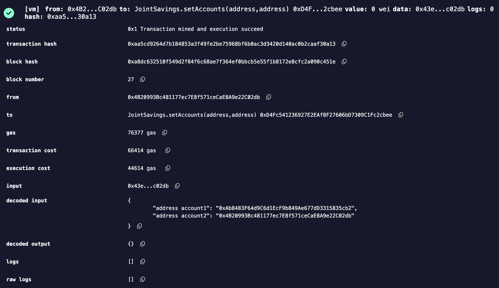

# JointSavings Project Report

## 1. Project Overview

The JointSavings project is a Solidity-based smart contract designed to manage joint savings accounts on the Ethereum blockchain. The purpose of this project is to automate the creation and management of joint savings accounts where two users, designated as joint account holders, can deposit and withdraw funds. The contract ensures that only the authorized account holders can access the funds, providing a secure and efficient way to manage shared savings.

## 2. Introduction to Blockchain and Smart Contracts

### Why Ethereum?

Ethereum was chosen as the platform for this project due to its widespread adoption, support for smart contracts, and a strong developer community. Ethereum enables the creation of decentralized applications (DApps) that run on a global network of nodes, ensuring transparency, security, and immutability.

### What are Smart Contracts?

Smart contracts are self-executing contracts with the terms of the agreement directly written into code. They automatically enforce and execute the contract's terms when predetermined conditions are met, eliminating the need for intermediaries and reducing the potential for fraud.

## 3. Tools Used

### Solidity Programming Language

Solidity is a contract-oriented programming language used for writing smart contracts on the Ethereum blockchain. It enables developers to encode the logic and rules that govern the interactions within a decentralized application (DApp). Solidity's features, such as strong typing, inheritance, and libraries, make it ideal for developing secure and robust contracts.

### JavaScript VM (Remix Ethereum)

The JavaScript VM is a local blockchain environment provided by Remix Ethereum for testing and deploying smart contracts. It allows developers to simulate the Ethereum blockchain on their local machine, enabling them to deploy contracts and execute transactions without incurring real costs. This environment is particularly useful for development, testing, and debugging.

### Remix Ethereum IDE

Remix Ethereum is a powerful web-based integrated development environment (IDE) for writing, testing, and deploying smart contracts. It offers a wide range of features, including a Solidity compiler, deployment options, and a rich user interface for interacting with deployed contracts. Remix also provides real-time debugging and logging, making it an essential tool for Ethereum developers.

## 4. Code Structure and Features

### Code Structure

The JointSavings contract is structured with clarity and functionality in mind. The key components of the contract include:

- **Variables**:
  - `address payable accountOne` and `address payable accountTwo`: Store the addresses of the two joint account holders.
  - `address public lastToWithdraw`: Tracks the last account to make a withdrawal.
  - `uint public lastWithdrawAmount`: Stores the amount of the last withdrawal.
  - `uint public contractBalance`: Reflects the current balance of the contract.
- **Functions**:
  - `setAccounts`: This function allows the contract owner to set the two joint account holders.
  - `deposit`: A payable function that allows any user to deposit Ether into the contract.
  - `withdraw`: A function that allows the joint account holders to withdraw Ether from the contract.
  - Fallback function: Allows the contract to receive Ether directly.

### Code Snippet: Setting Accounts

```solidity
function setAccounts(address payable account1, address payable account2) public {
    accountOne = account1;
    accountTwo = account2;
}
```
This function sets the two addresses that will control the joint savings account. It is crucial for establishing the ownership of the contract's funds.

### Code Snippet: Deposit Function

```solidity
function deposit() public payable {
    contractBalance = address(this).balance;
}
```
This function allows any user to deposit Ether into the contract. The deposited funds are added to the contractBalance, which reflects the total amount of Ether stored in the contract. This is critical for ensuring that the joint account holders can manage and withdraw the funds securely.

### Code Snippet: Withdraw Function

```solidity
function withdraw(uint amount, address payable recipient) public {
    require(recipient == accountOne || recipient == accountTwo, "You don't own this account!");
    require(address(this).balance >= amount, "Insufficient funds!");

    if (lastToWithdraw != recipient) {
        lastToWithdraw = recipient;
    }
    recipient.transfer(amount);
    lastWithdrawAmount = amount;
    contractBalance = address(this).balance;
}
```
This function allows either of the joint account holders to withdraw funds from the contract. It includes security checks to ensure that only authorized accounts can withdraw and that the contract has sufficient funds for the withdrawal.

## Features of the Code

- **Security**: The contract restricts withdrawals to the two designated joint account holders, ensuring that only authorized users can access the funds.
- **Transparency**: The contract provides functions to check the balance and track the last withdrawal, offering transparency in fund management.
- **Flexibility**: The contract allows for any Ethereum address to deposit funds, making it versatile and adaptable to different scenarios.

## 5. Remix Ethereum IDE

### Features of Remix Ethereum

- **Solidity Compiler**: Enables real-time compilation of Solidity code, highlighting errors and warnings as you type.
- **Deploy & Run Transactions**: Provides an interface for deploying contracts and executing functions on a simulated blockchain.
- **Debugging Tools**: Offers detailed transaction logs, debugging options, and the ability to analyze contract execution step-by-step.
- **Plugin System**: Allows for the extension of functionality with plugins tailored to specific development needs.

### Purpose of Remix Ethereum in This Project

Remix Ethereum was used in this project to write, test, and deploy the JointSavings contract. Its integrated environment provided the necessary tools to simulate the Ethereum blockchain, allowing for thorough testing of the contract's functionality before deployment on a live network. The JavaScript VM was particularly useful for simulating transactions, verifying that the contract behaved as expected in different scenarios.

## 6. Understanding Addresses in Ethereum

### Account Addresses vs. Contract Address

In Ethereum, an account address represents an individual user or entity capable of holding and transferring Ether. An account address is linked to a private key, allowing the owner to sign transactions and interact with the blockchain.

A contract address, on the other hand, is generated when a smart contract is deployed to the Ethereum network. This address is unique to the contract and serves as the interface through which users can interact with the contract's functions.

### JointSavings as a Contract

The JointSavings contract itself is not a physical account address but a smart contract residing at a unique contract address on the Ethereum network. The contract manages Ether deposits and withdrawals according to the rules encoded within it, rather than being a traditional account.

### Specific Addresses Used in This Project

Below are the specific addresses used in this project, each playing a distinct role in the operation of the JointSavings contract:

- **JointSavings Creator Address**: 0x5B38Da6a701c568545dCfcB03FcB875f56beddC4
  - This is the address that deployed the JointSavings contract. It holds no special privileges after deployment but is the origin of the contract.
- **JointSavings Contract Address**: 0xD4Fc541236927E2EAf8F27606bD7309C1Fc2cbee
  - This is the unique address assigned to the JointSavings contract on the Ethereum network. All interactions with the contract (deposits, withdrawals) occur through this address.
- **AccountOne Address**: 0xAb8483F64d9C6d1EcF9b849Ae677dD3315835cb2
  - This address has been designated as one of the two joint account holders. It is authorized to withdraw funds from the contract.
- **AccountTwo Address**: 0x4B20993Bc481177ec7E8f571ceCaE8A9e22C02db
  - This is the second joint account holder's address, also authorized to withdraw funds from the contract.
- **5 Ether Deposit by Address**: 0x78731D3Ca6b7E34aC0F824c42a7cC18A495cabaB
  - This address made a deposit of 5 Ether into the JointSavings contract, increasing the contract's balance.
- **10 Ether Deposit by Address**: 0x617F2E2fD72FD9D5503197092aC168c91465E7f2
  - This address made a deposit of 10 Ether into the JointSavings contract, further increasing the contract's balance.

### Summary

By documenting these addresses, we can clearly track the roles and interactions of each participant in the JointSavings contract. This helps ensure that all transactions are accounted for and that the contract functions as intended, with only the authorized accounts able to withdraw funds.

## 7. Project Flow

### 1. Contract Deployment

The project begins with the deployment of the `JointSavings` contract using the JavaScript VM in Remix Ethereum. The deployment process assigns a unique contract address, which will be used to interact with the contract.

**Screenshot:** 

### 2. Setting the Joint Account Holders

Once the contract is deployed, the `setAccounts` function is used to designate the two joint account holders. This step is crucial for defining the authorized users who can withdraw funds from the contract.

**Screenshot:** 

### 3. Depositing Ether into the Contract

The next step involves depositing Ether into the contract. Any Ethereum address can send funds to the contract, but only the joint account holders can withdraw them.

**Screenshot:**   
**Screenshot:** 

### 4. Withdrawing Ether from the Contract

The final step is withdrawing funds from the contract. The joint account holders can withdraw Ether according to the amount they specify. The contract ensures that only authorized addresses can perform this action.

**Screenshot:**   
**Screenshot:** 

### Code Flow Breakdown

1. **Contract Creation**: The contract is deployed, and a unique address is assigned.
2. **Account Designation**: `setAccounts` is called to assign `accountOne` and `accountTwo`.
3. **Fund Deposits**: Ether is deposited into the contract using the `deposit` function.
4. **Fund Withdrawals**: Authorized withdrawals are made using the `withdraw` function, updating the contract balance accordingly.

## 8. Security Considerations

The `JointSavings` contract has been designed with security in mind:

- **Access Control**: The `withdraw` function includes `require` statements to ensure that only `accountOne` or `accountTwo` can withdraw funds, preventing unauthorized access.
- **Balance Check**: Before allowing a withdrawal, the contract checks that it has sufficient funds to cover the requested amount, preventing overdrafts.
- **Fallback Function**: The fallback function allows the contract to receive Ether, ensuring it can always accept deposits even if the `deposit` function is not called explicitly.

## 9. Testing and Debugging

The contract was thoroughly tested using the Remix Ethereum IDE. Key tests included:

- **Unauthorized Withdrawal Attempt**: Tested by trying to withdraw funds from an address that was not `accountOne` or `accountTwo`. The contract correctly rejected the transaction.
- **Insufficient Balance**: Tested by attempting to withdraw more Ether than was available in the contract. The contract correctly rejected the transaction.
- **Normal Operation**: Tested by depositing and withdrawing Ether using the designated joint account holders. The contract performed as expected, with the correct balances being reflected after each transaction.

## 10. Challenges and Learnings

Developing the `JointSavings` contract presented several challenges, particularly around ensuring that only authorized users could withdraw funds. Implementing and testing the access control logic was a valuable learning experience. Additionally, optimizing the contract to minimize gas usage while maintaining security and functionality was another key area of focus.

## 11. Future Improvements

Potential future enhancements to the `JointSavings` contract could include:

- **Automated Savings Plans**: Allowing users to set up recurring deposits or savings goals.
- **Interest Calculations**: Implementing logic to calculate and distribute interest on the deposited funds.
- **Multi-Signature Withdrawals**: Requiring both account holders to approve a withdrawal before it is executed.

## 12. Conclusion

The `JointSavings` project demonstrates the power and flexibility of smart contracts on the Ethereum blockchain. By automating the management of joint savings accounts, this contract provides a secure and efficient way for two users to manage shared funds. The project also highlights the importance of security in smart contract development, ensuring that funds are protected and only accessible by authorized users.

## 13. References

- [Solidity Documentation](https://soliditylang.org/docs/)
- [Remix Ethereum IDE](https://remix.ethereum.org/)
- [Ethereum Whitepaper](https://ethereum.org/en/whitepaper/)

## 14. Author

This report was prepared by **Alexandr Climenco** as part of my `JointSavings` project. With a background in FinTech and a strong interest in blockchain technology, I am dedicated to exploring the potential of decentralized finance (DeFi) and smart contracts. This project represents my journey in mastering Solidity programming and developing practical applications on the Ethereum blockchain. It reflects both the challenges I've encountered and the innovative solutions I've implemented.

Feel free to reach out to me via email at [digital.liberators@gmail.com](mailto:digital.liberators@gmail.com) or check out my other projects on [GitHub](https://github.com/AlexC3105).

---